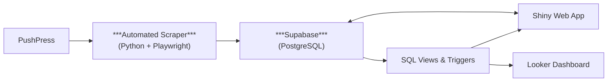

# 📊 Automated Attendance Pipeline & Dashboard

### 📌 Overview
This project automates the extraction, transformation, and reporting of member attendance data from a PushPress Looker dashboard.
It demonstrates how to build a full-stack data pipeline, leveraging automation, cloud database engineering, and interactive dashboards to generate actionable business insights. I originally used fastAPI to manage CRUD operations, but since I am hosting the app in render's free tier I had to use 2 services, which caused a delay. I opted to use SupaBase-py and keep everything in a single service.

### 🚀 Key Features
- Automated scraping of an embedded dashboard (with secure login & filter selection)
- Parsing and storing clean data in Supabase (PostgreSQL)
- SQL views & triggers to transform and manage data
- Interactive web app in Shiny for real-time tracking of kids assistance and engagement
- Additional Looker dashboard to track new leads

### 🔗 Full Workflow


### How it works:
1. Authenticate → filter → export fresh data automatically
2. Clean and push data to Supabase
3. Use views to filter kids vs. adults & identify new members
4. Triggers keep summary tables updated
5. Serve insights via Shiny and Looker dashboards

### 🗄️ Data Pipeline Highlights
- Automation: Playwright (Python) handles automatic login, filter selection, dynamic CSV exports, URL manipulation and API calls to SupaBase.
- Cloud Storage: Supabase Postgres stores all check-ins, sessions, and member details.
- Data Modeling: SQL views separate kids’ attendance and identify new kids for promotions. 
- Business Logic: Triggers & functions automatically manage new lead and kids records.
- Reporting: Shiny dashboard for internal use, Looker for stakeholder reporting.
### 🔒 Security & Best Practices
.env files used for API keys and credentials — never hardcoded.

### 🛠️ Tech Stack
| Layer            | Tool/Framework            |
| ---------------- | ------------------------- |
| **Automation**   | Python, Playwright        |
| **Data Storage** | Supabase (PostgreSQL)     |
| **Processing**   | SQL (views, triggers)     |
| **Reporting**    | Shiny, Looker Studio      |
| **Deployment**   | GitHub Actions, Supabase and Render |

### ✨ Impact
- Improved data accuracy & consistency by automating manual CSV exports 
- Reduced admin effort for tracking kids’ promotions & new leads
- Better business insights with self-serve dashboards & real-time updates

### 📂 Repository Structure
```bash
├── daily_update.py/         # Scraper scripts
├── pushdata.py/             # Saving data to supabase
├── update_kids_shiny.py/    # Web app source code
├── main.py/                 # FastAPI
├── README.md
└── requirements.txt         # Packages
```
### What I Learned
- Building robust automation for web scraping with session handling.
- Using Supabase as a cloud data warehouse.
- Writing efficient SQL for real-time views and triggers.
- Combining open-source and SaaS BI tools for end-to-end reporting.