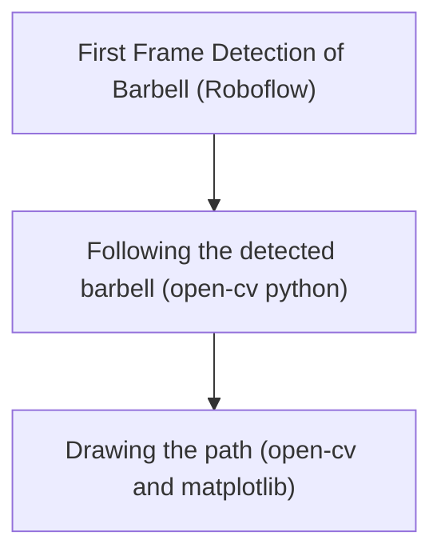

# Summary
Quick little project to detect barbell and trace the bar path to use in acceleration training and analyze performance over time.
### Skills used 
Python (vision frameworks like open cv and roboflow)
## Overall workflow 

![[Pasted image 20250728153306.png]]

[Learn more about it here](https://github.com/cmurga95/sports-performance/blob/main/bar-path-analysis/roboflow-trained.ipynb)