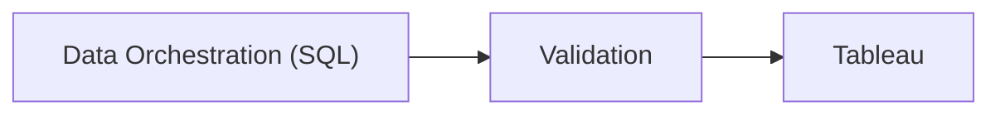

## Skills
SQL, Tableau
## Description
This dashboard tracks **Key Performance Indicators** (Average Handle Time, Average Calls per Agent, Total Calls, Average Idle Time, etc) used in a call center 
This Dashboard was used by the **debt collections department**. The goal was to identify areas of opportunity to optimize operations by tracking **Key Performance Indicators** (Average Handle Time, Average Calls per Agent, Total Calls, Average Idle Time, etc).
It involved orchestrating the ingestion of data from several sources (SQL) to make it usable to design a Tableau dashboard. Ultimately leading to optimizing resources and improving overall operation.