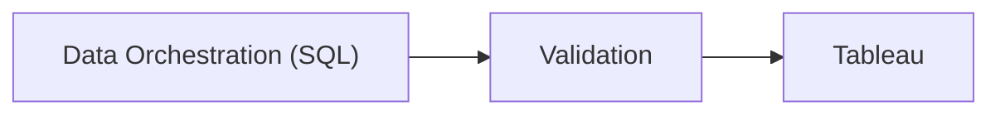

## Data Orchestration 
This phase consisted of joining data from many different sources, such as: 
- Agents
	- Making sure the agents are currently active within the company (not fired)
- Calls
	- Pulling the calls made by the agents
- Debt collections
	- Linking the phone numbers from agent calls to debt collections customer information
	- 