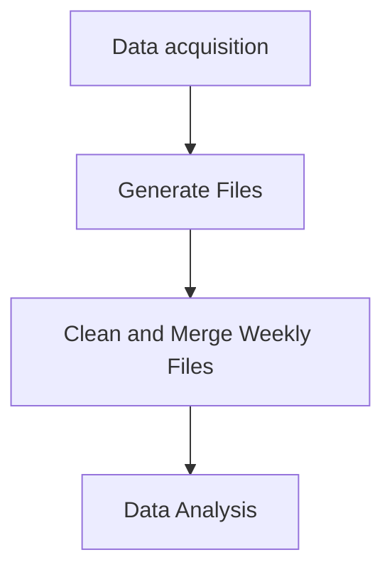
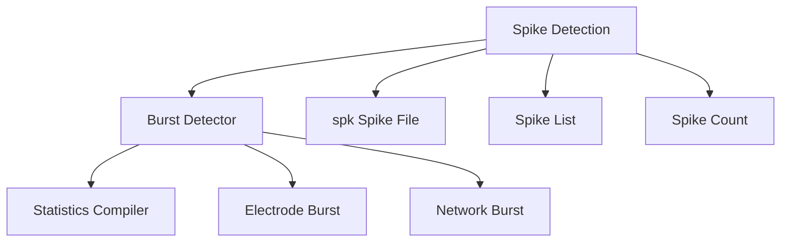

## Summary
My work as a Research Technician at the University of North Carolina involved working with Multi Electrode Array (MEA). This is a technique to measure electrical activity from neurons. 

# Data Acquisition

## Sample size calculation
The N number of samples would be calculated as followed: 
### Population size 
We know the total number of spikes per electrode, this would be our population size per electrode. 
### Margin of Error (Confidence Interval)
This percentage indicates how much our sample results may deviate from the true population value
### Confidence Level
This would reflect how confident we want to be that the true population parameter lies within the margin of error that we set. 
Common levels are: 

| Level | Z-Score |
| ----- | ------- |
| 90%   | 1.645   |
| 95%   | 1.96    |
| 99%   | 2.576   |

### Sample size
$n = \frac{z^2 \cdot p \cdot (1 - p)}{e^2}$
p = population proportion
e = margin of error 
z = z score associated with confidence level 

##### For finite populations (like ours)
If total number of spikes (N) is known and relatively small (e.g., <100,000), adjust the sample size:

$n=\frac {n_{0}}{1+\frac{(n_{0}−1)}{N}}$
​
This prevents oversampling when N is small.

**Important note, spikes selected must be random**
### Teager Energy Operator
It calculates the energy of a signal 
For this we should find signals where spikes are NOT present 

For discrete signals:
$x(n)=\frac{x(n)^2−x(n−1)x(n+1))}{T^2}$

Assumption of T = 1

But we can also use $1/fs$
##### Implementation to denoise signal 
1. Find a time where a signal is not present (e.g. It is pure noise) for each electrode (take 3 random spikes and use 1 ms before and 1 ms after, we can validate visually).
2. We assume that this noise is stationary (doesn't change overtime) and use this TEO (calculated on a per electrode basis) for each own electrode (if we want to validate each weeks readings we need to re-calculate for each reading, because noise can vary)
3. Based on this we clean each previously selected spike and reconstruct a clean spike. 
4. Move to SWT

